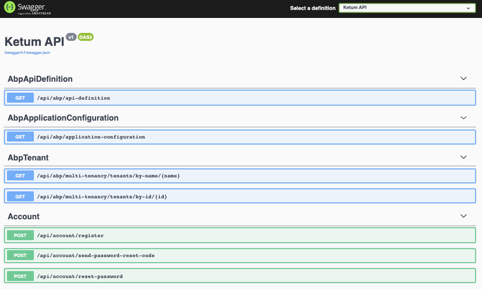
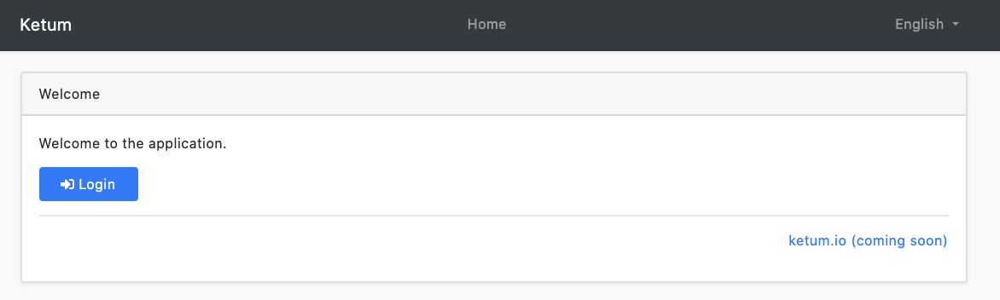
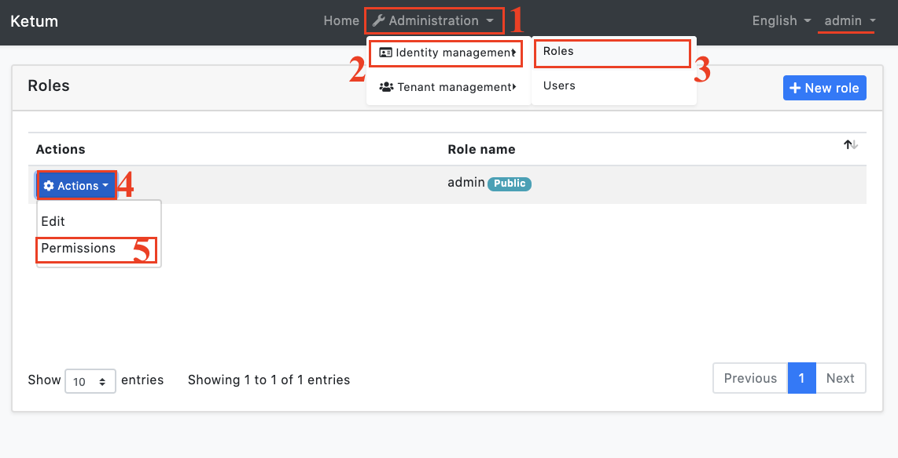
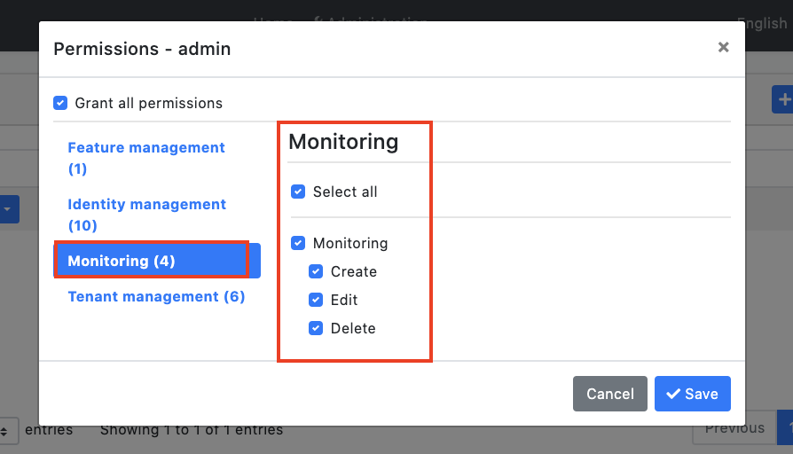

# Getting Started

This tutorial explains how to run Ketum.

## Setup Your Development Environment

Let's setup your development environment.

> Note: Ketum was created using the ABP framework startup template. So it fully supports ABP framework documentation. Please check the [ABP framework documentation](https://docs.abp.io/en/abp/latest) whenever you have any questions.

### Pre-Requirements

The following tools should be installed on your development machine:

* [Visual Studio 2019](https://visualstudio.microsoft.com/vs/) for Windows / [Visual Studio for Mac](https://visualstudio.microsoft.com/vs/mac/).
* [.NET Core 3.1+](https://www.microsoft.com/net/download/dotnet-core/)
* [Node v12 or v14](https://nodejs.org/)
* [Yarn v1.20+ (not v2)](https://classic.yarnpkg.com/en/docs/install) <sup id="a-yarn">[1](#f-yarn)</sup> or npm v6+ (already installed with Node)
* [Redis](https://redis.io/) (the startup solution uses the Redis as the [distributed cache](Caching.md)).
* Uses [RabbitMQ](https://www.rabbitmq.com/) for send your emails .

<sup id="f-yarn"><b>1</b></sup> _Yarn v2 works differently and is not supported._ <sup>[↩](#a-yarn)</sup>

## Create the Database

### Connection String

Check the **connection string** in the `appsettings.json` file under the `Ketum.IdentityServer` and `Ketum.HttpApi.Host` projects.

````json
"ConnectionStrings": {
    "Default": "Server=(LocalDb)\\MSSQLLocalDB;Database=Ketum;Trusted_Connection=True;MultipleActiveResultSets=true"
  }
````

Ketum is configured to use **Entity Framework Core** with **MS SQL Server** by default. EF Core supports [various](https://docs.microsoft.com/en-us/ef/core/providers/) database providers, so you can use any supported DBMS. See [the Entity Framework integration document](https://docs.abp.io/en/abp/latest/Entity-Framework-Core) to learn how to [switch to another DBMS](https://docs.abp.io/en/abp/latest/Entity-Framework-Core-Other-DBMS).

### Apply the Migrations

Ketum is uses the [Entity Framework Core Code First Migrations](https://docs.microsoft.com/en-us/ef/core/managing-schemas/migrations/?tabs=dotnet-core-cli). So, you need to apply migrations to create the database. There are two ways of applying the database migrations.

#### Apply Migrations Using the DbMigrator

Ketum comes with a `Ketum.DbMigrator` console application which applies migrations and also **seeds the initial data**. It is useful on **development** as well as on **production** environment.

> `Ketum.DbMigrator` project has its own `appsettings.json`. So, if you have changed the connection string above, you should also change this one. 

Right click to the `Ketum.DbMigrator` project and select **Set as StartUp Project**


Hit F5 (or Ctrl+F5) to run the application. It will have an output like shown below:


> Initial [seed data](https://docs.abp.io/en/abp/latest/Data-Seeding) creates the `admin` user in the database (with the password is `1q2w3E*`) which is then used to login to the application. So, you need to use `Ketum.DbMigrator` at least once for a new database.

#### Using EF Core Update-Database Command

Ef Core has `Update-Database` command which creates database if necessary and applies pending migrations.

Right click to the `Ketum.IdentityServer` project and select **Set as StartUp project**:


Open the **Package Manager Console**, select `Ketum.EntityFrameworkCore.DbMigrations` project as the **Default Project** and run the `Update-Database` command.

This will create a new database based on the configured connection string.

> **Using the `.DbMigrator` tool is the suggested way**, because it also seeds the initial data to be able to properly run the web application.
>
> If you just use the `Update-Database` command, you will have an empty database, so you can not login to the application since there is no initial admin user in the database. You can use the `Update-Database` command in development time when you don't need to seed the database. However, using the `Ketum.DbMigrator` application is easier and you can always use it to migrate the schema and seed the database.

## Run the Application

1. Ensure that the `Ketum.IdentityServer` project is the startup project. Run this application that will open a **login** page in your browser.

   You can login, but you cannot enter to the main application here. This is **just the authentication server**.

2. Ensure that the `Ketum.HttpApi.Host` project is the startup project and run the application which will open a **Swagger UI** in your browser.



This is the HTTP API that is used by the web application.

3. Lastly, ensure that the `Ketum.Web` project is the startup project and run the application which will open a **welcome** page in your browser.



Click to the **login** button which will redirect you to the *authentication server* to login to the application:


Enter **admin** as the username and **1q2w3E*** as the password to login to the application. The Ketum is up and running.

Now that our application is running, we must first set our roles:





Now all users with the admin role have full permissions on the monitor.

We have pretty clearly defined roles so I don't need to explain further.

> Note: If you want, you can create a new role and assign it to your new users as the default.

The application is designed to support multi-tenant, but has never been tested. I need your feedback on this subject. Please let me know about the problems you are experiencing and let's discuss them together and create a solution map.
